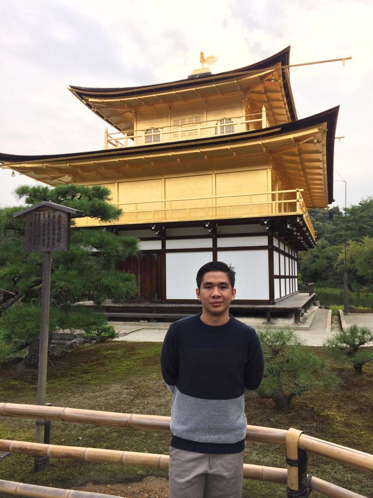

# Boy Oloan Page
> This is a mandatory assignment for week 0
## Profile Description
Hello all, my name is [**Boy Oloan**](https://drive.google.com/file/d/12Gv37J2HBULqfN7KbtGT1aP0MNEkYAUU/view?usp=share_link) . I am an MBA graduate from ITB and recently had worked at Cikarang.
 
 

I have expertisment for business and managemet world.
The skills I have acquired are decision making, negotiation, marketing, finance, problem solving, detail orientation, and business management.

## Personal Links
- Curriculum Vitae [CV Boy Oloan](https://drive.google.com/file/d/12Gv37J2HBULqfN7KbtGT1aP0MNEkYAUU/view?usp=share_link)
- Github [@yobnaolo](https://github.com/yobnaolo)

## Technical Skills
1. Office
2. Github
3. Visual Code
4. Corel Draw

## Favourite Websites
|  Name   |          URL           | Reason                                     |
|---------|------------------------|--------------------------------------------|
|Yahoo    |https://yahoo.com/      | Accsess email & gain news                  |
|Google   |https://google.com/     | Search about updates and personal needs    |
|Github   |https://github.com      | Learn about code and create website        |
|Marksheet|https://marksheet.io/   | Specifically learn about CSS               |

### Examples of Code
<details>
<summary>Markdown</summary>

``` 
#Hello Everyone
This is a kind of paragraph
```

</details>

<details>
<summary>HTML</summary>

```
<main class="content">
<h1>Hello Everyone</h1>
<p>This is a paragraph</p>
```

</details>

<details>
<summary>CSS</summary>

```
.content{
    color: #111;
    font-size: 1.2rem;
}
````


# w0-my-profile-yobnaolo
